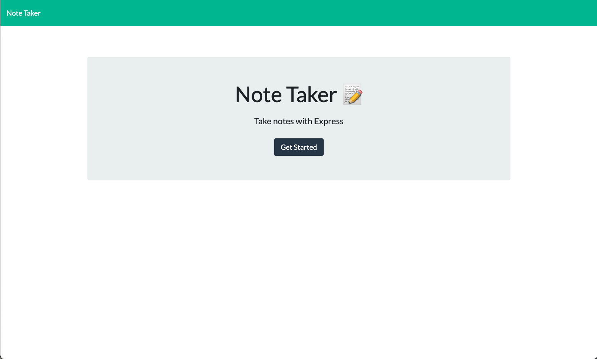
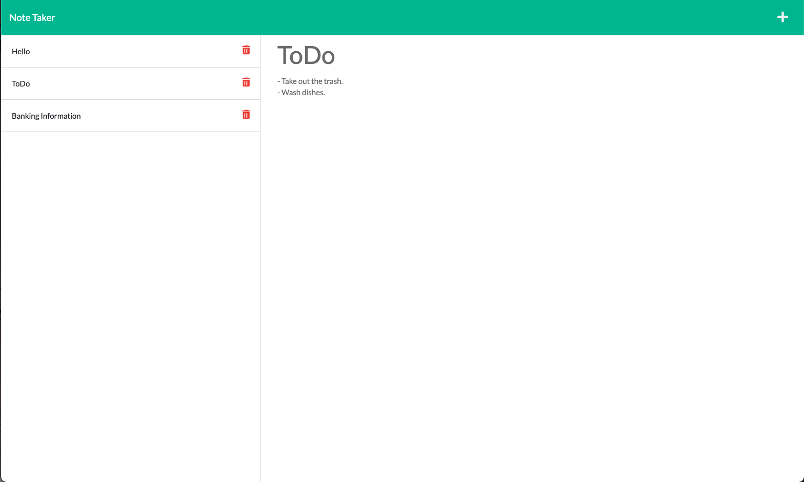

# Note Taker App

## Description 
This app will allow users to create notes and save them as tabs which the user can reference back to. 
Made with ExpressJS. 

## Installing 
Clone the repository to your local computer. 

Run npm install to install all dependencies. Verify that you have nodeJS installed onto your computer. 

## Deployed Link
- https://kalanim-note-taker.herokuapp.com/

## Built with
- Javascript
- NodeJS
- ExpressJS

## Author 
Kalani Mojica
  - https://github.com/mojikalani
  - https://www.linkedin.com/in/kalani-mojica-132042206/